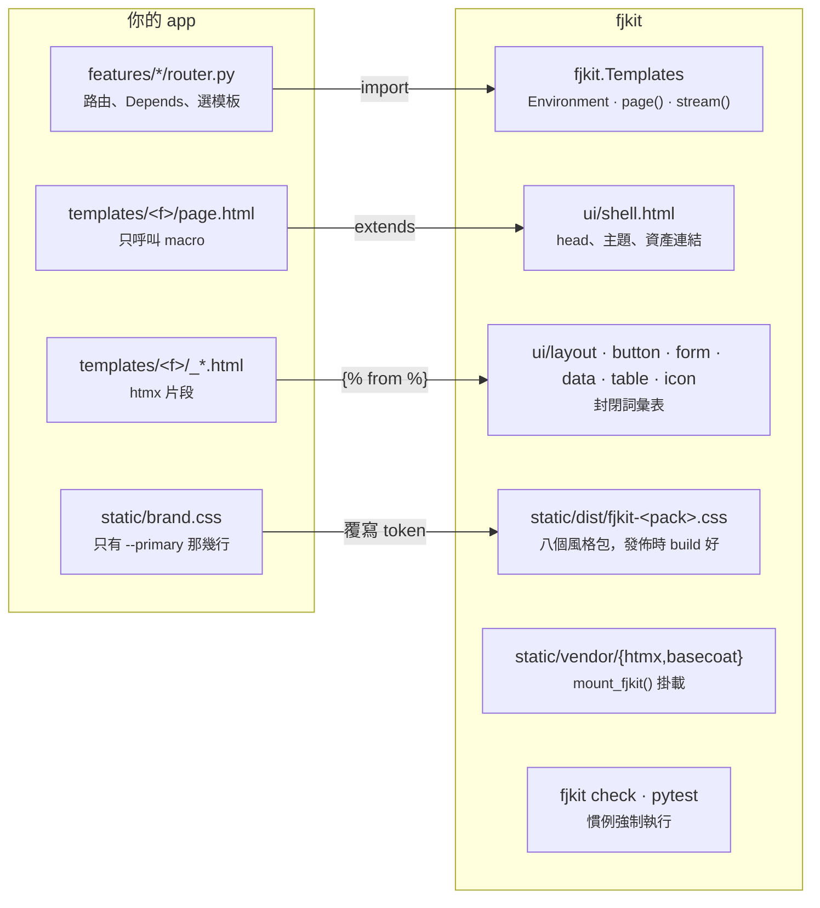
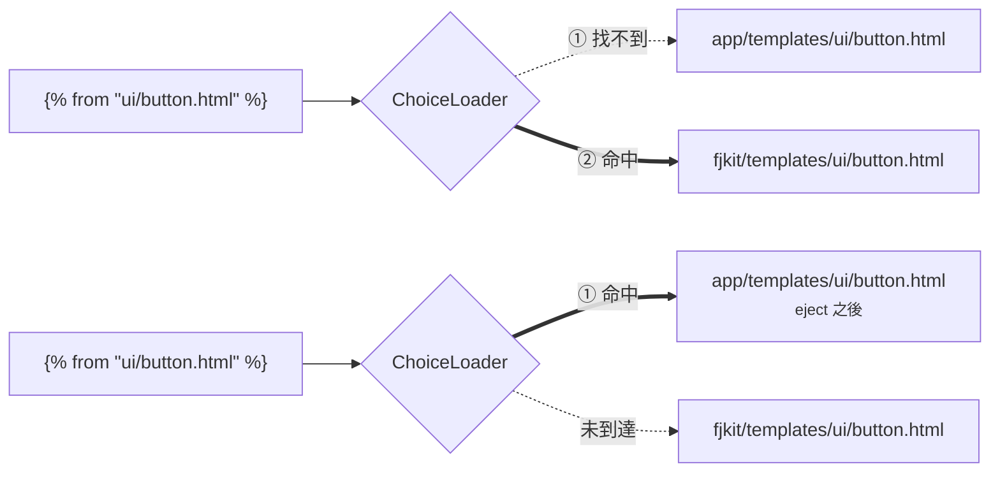
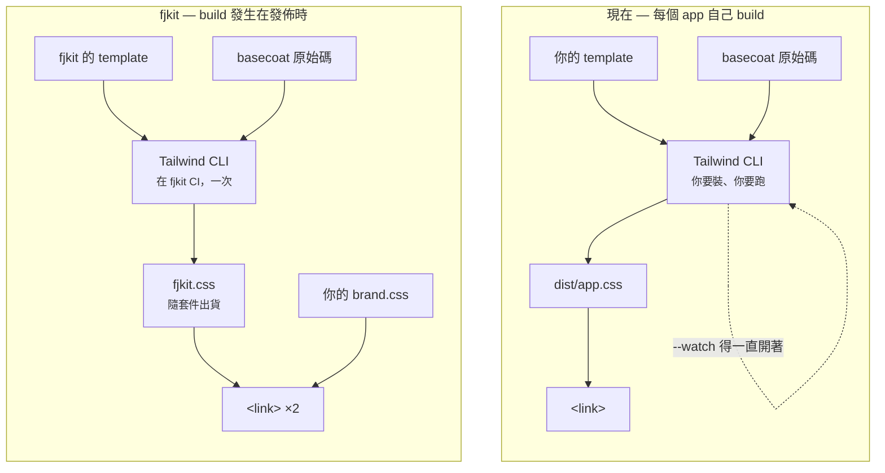
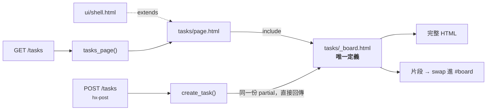
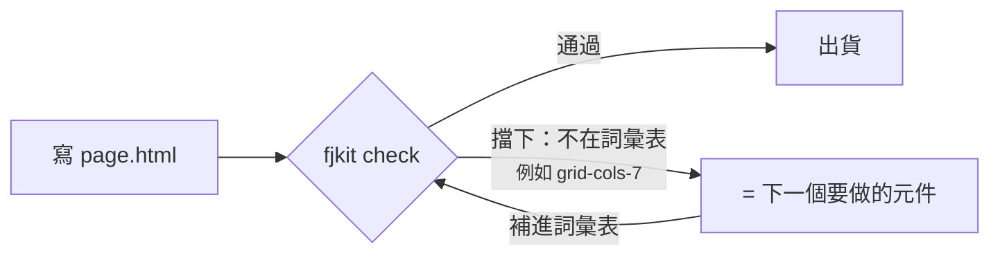

# fjkit 架構

五張圖，對應五個不再變動的架構決定。顏色慣例：**fjkit 提供** / **你提供**。

---

## 一 · 套件邊界

app 與 fjkit 只在四個地方接觸，其餘封在套件裡。

四條路徑都是單向的：app 依賴 fjkit，fjkit 不反向引用 app。`brand.css` 是唯一的設定
介面，內容是純 CSS 變數，不經過任何建置。

**不再需要**：`pytailwindcss`、`build_css.py --watch`、`vendor_ui.py`、「改 class 就重 build」。

---

## 二 · 模板解析與 eject

`ChoiceLoader` 把 app 的模板目錄排在套件前面，所以同一行 `` 在 eject 前後
解析到不同檔案，呼叫端不必改。

遮蔽是功能，不是意外。代價是 eject 出去的檔案不再跟隨版本升級，所以文件不主推它。
測試：`packages/fjkit/tests/test_vocabulary.py::TestLoaderOverride`。

---

## 三 · 建置時機

管線相同，執行的人與時機不同。差別是右邊少掉的那個 `--watch` 迴圈。

實測見 `docs/BACKLOG.md`：225 KB raw / 23.2 KB gzip，其中 217 KB 是 Basecoat 自己的
元件層，與 fjkit 寫了幾個 macro 無關。

---

## 四 · 渲染路徑：一份 partial，兩個入口

完整頁面與 htmx swap 走不同的路，落在同一個模板節點上。

`_board.html` 有兩條進、兩條出。完整頁面與 htmx 換上去的內容因此渲染自同一份原始碼，
兩者不會漂移。

---

## 五 · 詞彙表守門迴圈

封閉詞彙表要成立，違反就必須被擋下。每一次被擋下，都指出詞彙表缺了什麼。

這條回饋邊是 fjkit 唯一的擴張機制：以示範 app 當測試案例，被擋下的每一個 class 都是
一個還沒做的元件。

實測（0.1 完成時）：

| 目標 | 結果 |
|---|---|
| 舊 `app/templates`（fjkit 之前） | 258 violations |
| `examples/fjkit-demo/app/templates`（fjkit 重寫） | 0 violations |

白名單從 Basecoat 的元件 CSS 自動推導，不是手維護的，所以不會與實際出貨的內容脫節。
它也擋「目前碰巧存在的 utility」：app 若因為 shell 剛好吐出 `gap-4` 就拿來用，哪天
shell 不吐了就會無聲壞掉。
